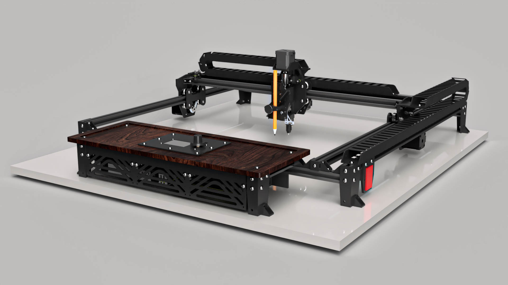

# Aria Art Plotter

**Professional large-format CNC drawing machine for artists and creators**

This is the Aria Art Plotter, a pen plotter made for artist.

---

## ✨ Key Features

- **Large Drawing Area**: 500mm × 500mm (20" × 20") usable area, expandable
- **Multi-Tool Support**: Pens, pencils, brushes, stamps, and more
- **Artist-Friendly**: Simplified interface designed for creators, not engineers
- **Whisper Quiet**: Silent TMC2209 stepper drivers
- **Smart Compensation**: Dual mesh system for beds and canvases
- **Remote Control**: WiFi/Ethernet connectivity with web interface
- **Open Source**: Complete build documentation, all files included

---

## 📋 What's Included in This Repository

This is a **complete open source package** to build your own Aria Art Plotter:

- **📘 170-Page Assembly Guide** - Complete safety instructions, BOM, visual IKEA-style assembly
- **🎥 15 Video Tutorials** - Step-by-step build process ([YouTube Channel](https://www.youtube.com/@aria_art_plot))
- **🔧 All Design Files**:
  - STL files for 3D printing
  - DXF files for CNC/laser cutting
  - 1 Arduino sketch
  - 3 Klipper configuration files with custom macros
  - 1 Python support file
- **📦 Complete Bill of Materials** - Every component with sources and alternatives

---

## 🎯 Who Is This For?

- **Artists** wanting to create large-format physical artwork from digital designs
- **Makers** interested in precision CNC systems and creative robotics
- **Educators** teaching about digital fabrication and art technology
- **Hobbyists** who enjoy building capable, professional-grade tools

---

## 🚀 Quick Start

### Prerequisites

- Basic mechanical assembly skills
- 3D printer access (for printed parts)
- Basic electronics knowledge (soldering, crimping)
- Budget: Cost of Materials. Check BOM on Amazon here: 

### Build Process Overview

1. **Review Documentation**: Read the [Assembly Guide](docs/AriaArtPlotterAssemblyManual_V1.pdf)
3. **Print Parts**: Download [STL files](hardware/stl/) and print components as per manual instruction
4. **Optional Cut Parts**: Process [DXF files](hardware/dxf/) for frame parts
5. **Assemble**: Follow video tutorials and assembly guide
6. **Install Firmware**: Configure [Klipper](firmware/klipper/) on the CB1
7. **Calibrate**: Run test patterns and mesh compensation
8. **Create**: Start drawing!

**Estimated Build Time**: 20-30 hours total

---

## 🔧 Technical Specifications

### Drawing Capabilities
- **Drawing Area**: 500mm × 500mm (20" × 20"), expandable
- **Z-Axis Travel**: 37mm adjustable to 42mm

### Mechanical System
- **Frame**: 2020 aluminum extrusion (20×20, Expandable to 40×40)
- **Motion**: Dual Y-axis motors, MGN12 linear rails, T8 lead screw
- **Wheels**: 24mm V-wheels for smooth operation

### Electronics
- **Controller**: BIGTREETECH Manta M5P V1.0 (32-bit ARM)
- **Compute**: BIGTREETECH CB1 V2.2
- **Drivers**: TMC2209 V1.3 (4×) - Silent operation
- **Motors**: NEMA 17 high-precision steppers
- **Firmware**: Klipper with custom macros
- **Display**: Mini12864 V2.0 LCD & .91 OLED Display
- **Probe**: BIQU MicroProbe V2 auto-leveling

### Advanced Features
- Tool support (pens, pencils, brushes, stamps, etc)
- Spring-loaded pressure control
- Dual mesh compensation (bed + canvas)
- Built-in test patterns
- WiFi/Ethernet connectivity
- Web interface (Mainsail/Fluidd)

[Full specifications →](docs/specifications.md)

---

## 🎥 Video Tutorials

Complete video build series available on our [YouTube Channel](https://www.youtube.com/@aria_art_plot):

---

## 🤝 Community & Support

- **Website**: [aria-art.com](https://aria-art.com/)
- **YouTube**: [@aria_art_plot](https://www.youtube.com/@aria_art_plot)
- **X/Twitter**: [@aria_art_plot](https://twitter.com/aria_art_plot)
- **Instagram**: [@aria_art_plot](https://instagram.com/aria_art_plot)
- **Threads**: [@aria_art_plot](https://threads.net/@aria_art_plot)
- **Printables**: [Aria Art Plotter](https://www.printables.com/@aria_art_3610199)
- **GitHub Discussions**: Share builds, ask questions, get help

### Contributing

We welcome contributions! Whether it's:
- **Bug fixes** and improvements
- **Documentation** enhancements
- **New features** and modifications
- **User builds** and artwork showcase

Please read [CONTRIBUTING.md](community/CONTRIBUTING.md) for guidelines.

---

## 📜 License

This project uses dual licensing:

- **Hardware** (STL, DXF, CAD): [CERN-OHL-S-2.0](LICENSE-HARDWARE.txt) - Strong reciprocal open hardware license
- **Documentation** (Assembly guide, docs): [CC BY-SA 4.0](LICENSE-DOCS.txt) - Creative Commons Attribution-ShareAlike

**Software/Firmware** (Arduino, Klipper configs, Python): GPL-3.0 (standard for Klipper derivatives)

### What This Means

✅ **You CAN**:
- Build and sell plotters using these designs
- Modify and improve the design
- Use commercially
- Share and distribute

📋 **You MUST**:
- Share your modifications under the same license
- Credit the original project
- Document your changes
- Keep the same license terms

---

## 🙏 Acknowledgments

- Klipper firmware team for exceptional CNC control software
- BIGTREETECH for accessible, powerful electronics
- The open source 3D printing and CNC community
- All the beta builders and testers who helped refine this design

---

## 📞 Support This Project

If the Aria Art Plotter helps you create amazing work:
- ⭐ **Star this repository**
- 📢 **Share your builds** on social media (tag @aria_art_plot)
- 🎨 **Show your artwork** in Discussions
- 🐛 **Report issues** to help improve the design
- 💡 **Contribute** improvements and modifications

---

**Ready to build?** Start with the [Assembly Guide](docs/assembly-guide.pdf) or watch the [Introduction Video](https://www.youtube.com/@aria_art_plot)!

*Making professional large-format art creation accessible to everyone.*